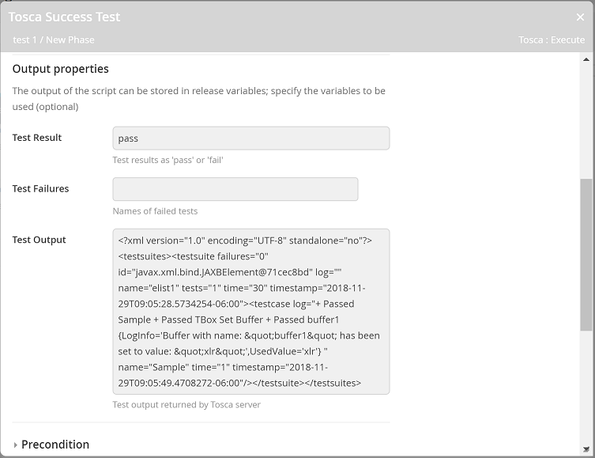
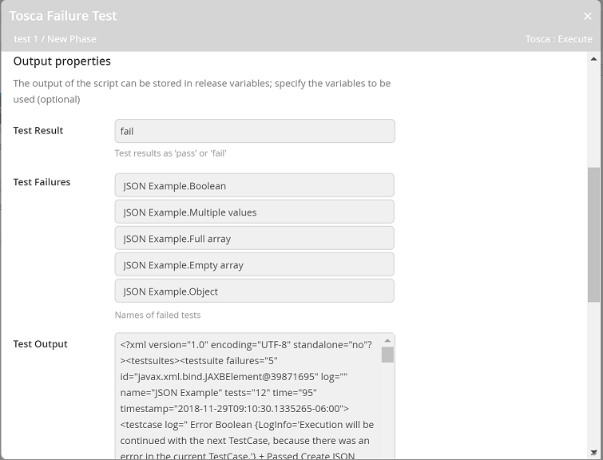

# XL Release Tosca Plugin

[![Build Status][xlr-tosca-plugin-travis-image]][xlr-tosca-plugin-travis-url]
[![License: MIT][xlr-tosca-plugin-license-image]][xlr-tosca-plugin-license-url]
![Github All Releases][xlr-tosca-plugin-downloads-image]

[xlr-tosca-plugin-travis-image]: https://travis-ci.org/xebialabs-community/xlr-tosca-plugin-v2.svg?branch=master
[xlr-tosca-plugin-travis-url]: https://travis-ci.org/xebialabs-community/xlr-tosca-plugin-v2
[xlr-tosca-plugin-license-image]: https://img.shields.io/badge/License-MIT-yellow.svg
[xlr-tosca-plugin-license-url]: https://opensource.org/licenses/MIT
[xlr-tosca-plugin-downloads-image]: https://img.shields.io/github/downloads/xebialabs-community/xlr-tosca-plugin-v2/total.svg

# Overview #

This plugin provides the ability to execute tests on a Tricentis Tosca server. It is using the ToscaCIJavaClient.jar file to call TOSCA server for running junit and getting back results. [ Reference to Java Client Documentation](https://documentation.tricentis.com/en/1000/content/continuous_integration/execution.htm)

See the **XL Release Reference Manual** for background information on XL Release and plugin concepts.

* **Requirements**
  * **XL Release** 7.5.0+
  * **Tricentis Tosca** 11.3+

# Installation #

* Copy the latest JAR file from the [releases page](https://github.com/xebialabs-community/xlr-tosca-plugin-v2/releases) into the `XL_RELEASE_SERVER/plugins/__local__` directory.
* Restart the XL Release server.

# Usage #

## Configure Server ##

Begin by configuring one or more Tosca servers.  Navigate to **Settings -> Shared configuration** and add a Tosca: Server.


### Title ###

Enter a descriptive name for this server.

### URL ###

Enter the full URL to the server.  Include protocol (http or https) and port number if applicable.  Note that this needs to be the full path to the Manager Service.  For example: http://<server>/DistributionServerService/ManagerService.svc

### Username ###

The current versions of Tosca (12.0 and below) do not use authentication so no username or password is needed.  When future versions of Tosca require authentication, enter the username here.

### Password ###

When future versions of Tosca require authentication, enter the password here.

### Domain ###

The NTLM domain for authentication if applicable.

### Proxy ###

Optional proxy information if you access the Tosca server through a proxy.

---

## Execute Tests Task ##

In your SDLC templates, you can add a task of type **Tosca -> Execute** as shown below.  When this task executes, the given Test Configuration will be run on the Tosca Server.


### Server ###

The Tosca Server that will run your tests.  

### Test Configuration ###

XML representation of the Test Configuration.  See the Tosca documentation for more information.

Example:

```<?xml version="1.0" encoding="utf-16" ?>
<testConfiguration>
    <TestEvents>
        <TestEvent>SampleTestEvent</TestEvent>
    </TestEvents>
</testConfiguration>
```

### Polling Interval ###

How long, in seconds, to wait between polling for results.

### Timeout ###

Total time, in seconds, to wait for results.  The task will fail if no results are retrieved within this time period.


The Tosca plugin generates output that you may find useful in later tasks.  First define the variable for the template.  The test results and test output variables should be type 'text'.  The test failures variable must be type 'list'.

### Test Results ###

Returns either 'pass' or 'fail'.

### Test Failures ###

List of test names that failed.

### Test Output ###

The full test output.  This can be helpful if you want to parse the output and carry out specific tasks based on that information.

---

### Example Output ###

Once the task is complete you will see output like these shown below...





# Developers #

Build and package the plugins with...

```bash
./gradlew shadowJar
```

Run unit tests with...

```bash
./gradlew pyTest
```
