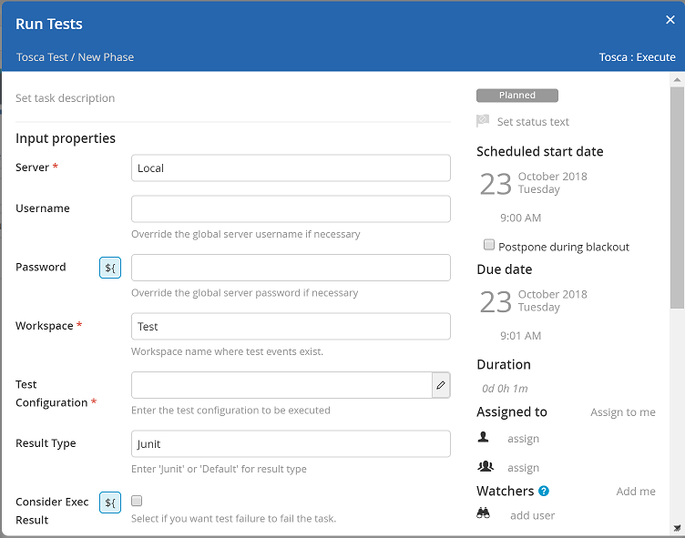
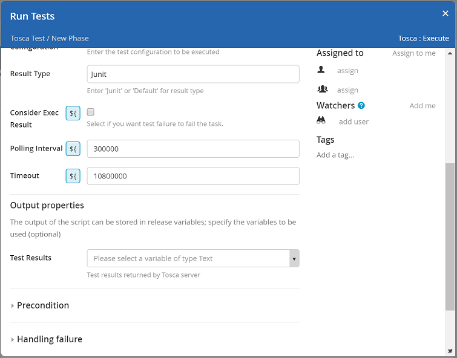

# XL Release Tosca Plugin

[![Build Status][xlr-tosca-plugin-travis-image]][xlr-tosca-plugin-travis-url]
[![License: MIT][xlr-tosca-plugin-license-image]][xlr-tosca-plugin-license-url]
![Github All Releases][xlr-tosca-plugin-downloads-image]

[xlr-tosca-plugin-travis-image]: https://travis-ci.org/xebialabs-community/xlr-tosca-plugin.svg?branch=master
[xlr-tosca-plugin-travis-url]: https://travis-ci.org/xebialabs-community/xlr-tosca-plugin
[xlr-tosca-plugin-license-image]: https://img.shields.io/badge/License-MIT-yellow.svg
[xlr-tosca-plugin-license-url]: https://opensource.org/licenses/MIT
[xlr-tosca-plugin-downloads-image]: https://img.shields.io/github/downloads/xebialabs-community/xlr-tosca-plugin/total.svg

# Overview #

This plugin provides the ability to execute tests on a Tricentis TOSCA server.

See the **XL Release Reference Manual** for background information on XL Release and plugin concepts.

* **Requirements**
  * **XL Release** 7.5.0+
  * **Tosca** 11.3+

# Installation #

* Copy the latest JAR file from the [releases page](https://github.com/xebialabs-community/xlr-tosca-plugin/releases) into the `XL_RELEASE_SERVER/plugins/__local__` directory.
* Restart the XL Release server.

# Usage #

## Configure Server ##

Begin by configuring one or more TOSCA servers.  Navigate to **Settings -> Shared configuration** and add a Tosca: Server.


### Title ###

Enter a descriptive name for this server.

### URL ###

Enter the full URL to the server.  Include protocol (http or https) and port number if applicable.

### Username ###

Username XL Release will use to connect to the TOSCA server.  The user will need the necessary permissions to run the desired test.  You can optionally leave this field blank and specify username in the task.  This way you can have finer grained control over user accounts and permissions.

### Password ###

Enter the password for the above user account.  Like username, you can leave this field blank and specify the password with the task.

### Domain ###

The NTLM domain for authentication if applicable.

### Proxy ###

Optional proxy information if you access the TOSCA server through a proxy.

## Execute Tests Task ##

In your SDLC templates, you can add a task of type **Tosca -> Execute** as shown below.  When this task executes, the given Test Configuration will be run on the TOSCA Server.



### Server ###

The TOSCA Server that will run your tests.  Example endpoint: http://<server>/DistributionServerService/ManagerService.svc

### Workspace ###

The TOSCA workspace that has the test events defined in the Test Configuration.

### Test Configuration ###

XML representation of the Test Configuration.  See the TOSCA documentation for more information.

Example:
```
<?xml version="1.0" encoding="utf-16" ?>
<testConfiguration>
    <TestEvents>
        <TestEvent>SampleTestEvent</TestEvent>
    </TestEvents>
</testConfiguration>
```

### Result Type ###

The form of the test results expected.  This can be 'Junit' or 'Default'.

### Consider Exec Result ###

If checked, the task will fail if any tests fail.  Otherwise the task will complete successfully if the tests were run, regardless if any tests failed.



### Polling Interval ###

How long, in seconds, to wait between polling for results.

### Timeout ###

Total time, in seconds, to wait for results.  The task will fail with no results are retrieved within this time period.

### Test Results ###

You can optionally attach the test results to a variable in XL Release.  This can be helpful if you want to parse the results and carry out specific tasks based on that information.

# Developers #

Build and package the plugins with...

```bash
./gradlew shadowJar
```

# TO DO #

* Implement 'Consider Exec Result' functionality in execute_test.py.  The client library implements this in main.java which we are not calling.
